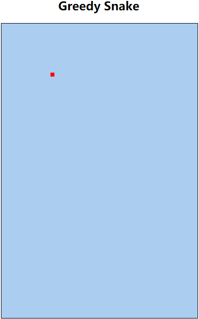

# 1. 贪吃蛇版本迭代（V1） 

- 张大为
- 辽宁师范大学计算机与信息技术学院@大连
- [https://daweizh.github.io/h5/](https://daweizh.github.io/h5/)  QQ:1243605845

## 1.1 需求说明

- 初始化游戏场景
- 在坐标(100,100)处放置大小为8x8的食物

## 1.2 效果设计

## 1.3 编程过程

1. 修改网页标题
    ~~~html
    <title>Greedy Snake</title>
    ~~~
2. 增加游戏标题
	~~~html
	<h2 align="center">Greedy Snake</h2>
	~~~
3. 增加游戏场景
	~~~html
    

        <canvas id="field" width="400" height="600">
            This is the field that snake snaking.
        </canvas>
    

	~~~
4. 改变场景样式
	~~~html
    
	~~~
5. 绘制食物
	~~~html
    
	~~~

## 1.4 代码注解

~~~html
<!DOCTYPE html>
<html>
    <head>
        <meta charset="utf-8" />
        <title>Greedy Snake</title>
        
        
    </head>
    <body>
        <!-- 标题是如何居中的？ -->
        <h2 align="center">Greedy Snake</h2>
        <!-- 画布时如何居中的？ -->
        

            <!-- 画布的样式是如何改变的？ -->
            <canvas id="field" width="400" height="600">
                This is the field that snake snaking.
            </canvas>
        

    </body>
</html>
~~~

## 1.5 核心代码

~~~html
<!DOCTYPE html>
<html>
    <head>
        <meta charset="utf-8" />
        <title>Greedy Snake</title>
        
        
    </head>
    <body>
        <h2 align="center">Greedy Snake</h2>
        

            <canvas id="field" width="400" height="600">
                This is the field that snake snaking.
            </canvas>
        

    </body>
</html>
~~~

## w.微信订阅号

1. 智数精英-关注中小学程序设计及相关讨论
2. 随话录-记录小朋友们的成长时光
2. 西山征途-关注大学生成长、学习和生活

----------

## b.[返回](../)

## t.[首页](../../)

