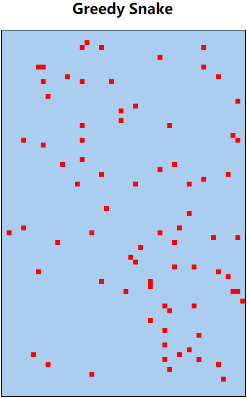

# 2. 贪吃蛇版本迭代（V2） 

- 张大为
- 辽宁师范大学计算机与信息技术学院@大连
- [https://daweizh.github.io/h5/](https://daweizh.github.io/h5/)  QQ:1243605845

## 2.1 需求说明

- 初始化食物大小（和蛇节大小相同）snakeUnitSize，默认值为8
- 获取游戏场景大小fieldWidth和fieldHeight
- 计算食物随机投放的网格位置foodX和foodY，默认值为（0,0）
- 间隔speed（默认值160ms）后，putFood投放食物

## 2.2 效果设计

## 2.3 编程过程

1. 增加全局变量
    ~~~js
    var fieldWidth;
    var fieldHeight;
    var speed = 160;
    var foodX = foodY = 0;
    var snakeUnitSize = 8;
    ~~~
2. 在window.onload中删除代码
    ~~~js
    game.fillStyle = "#ff0000";
    game.strokeStyle = "#000000";
    game.fillRect(100, 100, 8, 8);
    ~~~
3. 在window.onload中增加代码
	~~~js
    fieldWidth = field.width;
    fieldHeight = field.height;
    window.setInterval(putFood, speed);
	~~~
4. 增加投放食物功能
	~~~js
    function putFood(){
        var size = snakeUnitSize;
        game.fillStyle = "#ff0000";
        game.strokeStyle = "#000000";
        foodX = Math.ceil(Math.random() * (fieldWidth/size));
        foodY = Math.ceil(Math.random() * (fieldHeight/size));
        game.fillRect(foodX*size, foodY*size, size, size);
    } 
	~~~

## 2.4 代码注解

~~~js

~~~

## 2.5 核心代码

~~~html
<!DOCTYPE html>
<html>
    <head>
        <meta charset="utf-8" />
        <title>Greedy Snake</title>
        
        
    </head>
    <body>
        <!-- v1 -->
        <h2 align="center">Greedy Snake</h2>
        <!-- v1 -->
        

            <!-- v1 -->
            <canvas id="field" width="400" height="600">
                This is the field that snake snaking.
            </canvas>
        

    </body>
</html>
~~~

## w.微信订阅号

1. 智数精英-关注中小学程序设计及相关讨论
2. 随话录-记录小朋友们的成长时光
2. 西山征途-关注大学生成长、学习和生活

----------

## b.[返回](../)

## t.[首页](../../)
