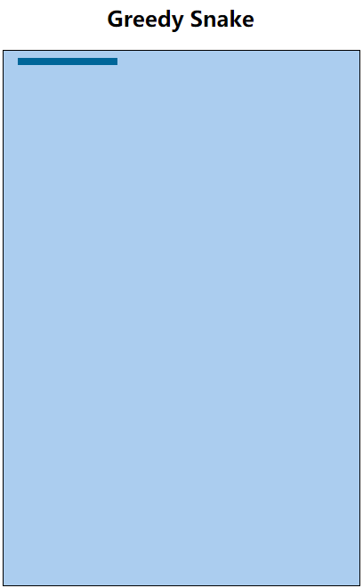

# 3. 贪吃蛇版本迭代（V3） 

- 张大为
- 辽宁师范大学计算机与信息技术学院@大连
- [https://daweizh.github.io/h5/](https://daweizh.github.io/h5/)  QQ:1243605845

## 3.1 需求说明

- 初始化蛇头开始出没的位置坐标(x,y)，默认值为snakeUnitSize
- 让蛇动起来，间隔speed（默认值160ms）后，snakeMove蛇头前进一步

## 3.2 效果设计

## 3.3 编程过程

1. 增加蛇头坐标全局变量
    ~~~
    var x = y = snakeUnitSize;
    ~~~
2. 在window.onload中，修改代码
	~~~
    window.setInterval(putFood, speed);
	~~~
	为
	~~~
	window.setInterval(snakeMove, speed);
	~~~
3. 增加蛇头水平向右行走代码
	~~~
    function snakeMove(){
        x = x + snakeUnitSize;
        game.fillStyle = "#006699";
        game.strokeStyle = "#006699"; 
        game.fillRect(x, y, snakeUnitSize, snakeUnitSize);
    }       
	~~~

## 3.4 代码注解

~~~

~~~

## 3.5 核心代码

~~~
<!DOCTYPE html>
<html>
    <head>
        <meta charset="utf-8" />
        <title>Greedy Snake</title>
        
        
    </head>
    <body>
        <!-- v1 -->
        <h2 align="center">Greedy Snake</h2>
        <!-- v1 -->
        

            <!-- v1 -->
            <canvas id="field" width="400" height="600">
                This is the field that snake snaking.
            </canvas>
        

    </body>
</html>
~~~

## w.微信订阅号

1. 智数精英-关注中小学程序设计及相关讨论
2. 随话录-记录小朋友们的成长时光
2. 西山征途-关注大学生成长、学习和生活

----------

## b.[返回首页](../../)

