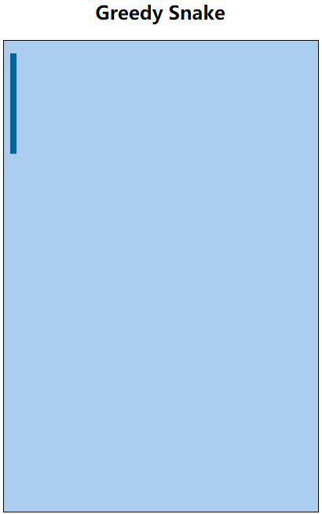

# 4. 贪吃蛇版本迭代（V4） 

- 张大为
- 辽宁师范大学计算机与信息技术学院@大连
- [https://daweizh.github.io/h5/](https://daweizh.github.io/h5/)  QQ:1243605845

## 4.1 需求说明

- 增加蛇行方向变量direction
- 让蛇动起来，间隔speed（默认值160ms）后，snakeMove蛇头前进一步

## 4.2 效果设计

## 4.3 编程过程

1. 增加蛇行方向变量
    ~~~js
    var direction = 3;
    ~~~
2. 在snakeMove()中，修改代码
	~~~js
    x = x + snakeUnitSize;
	~~~
	为
	~~~js
    switch(direction){ 
        case 0:
            x = x - snakeUnitSize;
            break; 
        case 1:
            y = y - snakeUnitSize;
            break; 
        case 2:
            x = x + snakeUnitSize;
            break; 
        case 3:
            y = y + snakeUnitSize;
            break; 
    } 
	~~~
3. 增加判断蛇行越界代码
	~~~js
    if(x>fieldWidth || y>fieldHeight || x<0 || y<0){
        alert("你挂了，继续努力吧!失败原因：碰壁了.....");
        window.location.reload(); 
    }
	~~~

## 4.4 代码注解

~~~js

~~~

## 4.5 核心代码

~~~
<!DOCTYPE html>
<html>
    <head>
        <meta charset="utf-8" />
        <title>Greedy Snake</title>
        
        
    </head>
    <body>
        <!-- v1 -->
        <h2 align="center">Greedy Snake</h2>
        <!-- v1 -->
        

            <!-- v1 -->
            <canvas id="field" width="400" height="600">
                This is the field that snake snaking.
            </canvas>
        

    </body>
</html>
~~~

## w.微信订阅号

1. 智数精英-关注中小学程序设计及相关讨论
2. 随话录-记录小朋友们的成长时光
2. 西山征途-关注大学生成长、学习和生活

----------

## b.[返回](../)

## h.[首页](../../)
