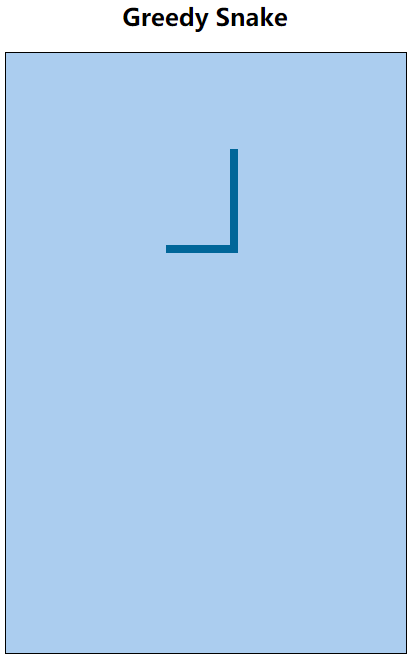

# 6. 贪吃蛇版本迭代（V6） 

- 张大为
- 辽宁师范大学计算机与信息技术学院@大连
- [https://daweizh.github.io/h5/](https://daweizh.github.io/h5/)  QQ:1243605845

## 6.1 需求说明

- 设定初始蛇身长度
- 定义蛇身容器
- 记录蛇身轨迹坐标

## 6.2 效果设计

## 6.3 编程过程

1. 定义蛇长长度变量和蛇身容器变量
    ~~~js
    var snakeLength = 20;
    var pathMap = []; 
    ~~~
2. 在snakeMove方法中增加在蛇身容器中保存蛇身坐标功能
    ~~~js
    if (pathMap.length>snakeLength) {
        var snakeTail = pathMap.shift();
        game.clearRect(snakeTail['x'], snakeTail['y'], snakeUnitSize, snakeUnitSize); 
    };
    pathMap.push({'x':x,'y':y});
    ~~~
## 6.4 代码注解

~~~js

~~~

## 6.5 核心代码

~~~
<!DOCTYPE html>
<html>
    <head>
        <meta charset="utf-8" />
        <title>Greedy Snake</title>
        
        
    </head>
    <body>
        <!-- v1 -->
        <h2 align="center">Greedy Snake</h2>
        <!-- v1 -->
        

            <!-- v1 -->
            <canvas id="field" width="400" height="600">
                This is the field that snake snaking.
            </canvas>
        

    </body>
</html>
~~~

## w.微信订阅号

1. 智数精英-关注中小学程序设计及相关讨论
2. 随话录-记录小朋友们的成长时光
2. 西山征途-关注大学生成长、学习和生活

----------

## b.[返回](../)

## h.[首页](../../)
