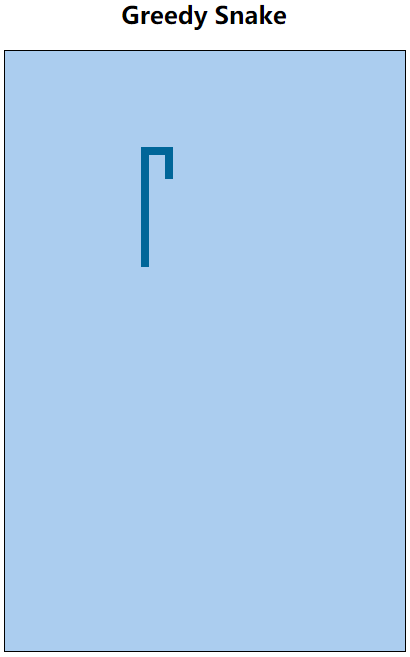

# 7. 贪吃蛇版本迭代（V7） 

- 张大为
- 辽宁师范大学计算机与信息技术学院@大连
- [https://daweizh.github.io/h5/](https://daweizh.github.io/h5/)  QQ:1243605845

## 7.1 需求说明

- 判定蛇身是否缠绕

## 7.2 效果设计

## 7.3 编程过程

- 判断蛇头是否与蛇身发生碰撞
    ~~~js
    for(var i=0; i<pathMap.length; i++){
        if( parseInt(pathMap[i].x)==x && parseInt(pathMap[i].y)==y){
            alert("你挂了，继续努力吧！失败原因：撞到自己了.....");
            window.location.reload(); 
        } 
    } 
    ~~~

## 7.4 代码注解

~~~js

~~~

## 7.5 核心代码

~~~
<!DOCTYPE html>
<html>
    <head>
        <meta charset="utf-8" />
        <title>Greedy Snake</title>
        
        
    </head>
    <body>
        <!-- v1 -->
        <h2 align="center">Greedy Snake</h2>
        <!-- v1 -->
        

            <!-- v1 -->
            <canvas id="field" width="400" height="600">
                This is the field that snake snaking.
            </canvas>
        

    </body>
</html>
~~~

## w.微信订阅号

1. 智数精英-关注中小学程序设计及相关讨论
2. 随话录-记录小朋友们的成长时光
2. 西山征途-关注大学生成长、学习和生活

----------

## b.[返回](../)

## h.[首页](../../)
