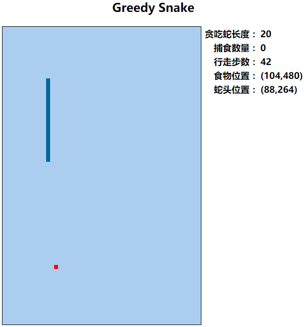

# 9. 贪吃蛇版本迭代（V9） 

- 张大为
- 辽宁师范大学计算机与信息技术学院@大连
- [https://daweizh.github.io/h5/](https://daweizh.github.io/h5/)  QQ:1243605845

## 9.1 需求说明

- 重构网页布局增加游戏状态显示
- 增加游戏状态记录变量
- 增加消息栏对象变量
- 增加游戏状态收集功能
- 增加游戏状态显示功能

## 9.2 效果设计

## 9.3 编程过程

1. 重构网页布局，将`<body>`标记内容替换成如下内容
    ~~~html
    

        <h2>Greedy Snake</h2>
        <table>
            <tr>
                <td>
                    <canvas id="field" width="400" height="600">
                        This is the field that snake snaking.
                    </canvas>
                </td>
                <td valign="top" align="left">
                    <table class="show">
                        <tr>
                            <td align="right">贪吃蛇长度：</td>
                            <td align="left" id="snakes">35</td>
                        </tr>
                        <tr>
                            <td align="right">捕食数量：</td>
                            <td align="left" id="foods">14</td>
                        </tr>
                        <tr>
                            <td align="right">行走步数：</td>
                            <td align="left" id="steps">1000</td>
                        </tr>
                        <tr>
                            <td align="right">食物位置：</td>
                            <td align="left" id="foodPlace">14</td>
                        </tr>
                        <tr>
                            <td align="right">蛇头位置：</td>
                            <td align="left" id="snakePlace">1000</td>
                        </tr>
                    </table>
                </td>
            </tr>
        </table>
    

    ~~~
2. 删除`div`样式，增加`.show`样式
    ~~~css
    .show{
        font-family: "微软雅黑";
        font-size: large;
        font-weight: bold;
    }
    ~~~
3. 增加游戏状态计数变量
    ~~~js
    var foodNumber = -1;
    var walkSteps = 0;
    ~~~
4. 增加游戏状态消息栏变量
    ~~~js
    var foods;
    var snakes;
    var foodPlace;
    var snakePlace;
    var steps;
    ~~~
5. 在`widnow.onload`方法中获取状态栏对象
    ~~~js
    foods = document.getElementById("foods");
    snakes = document.getElementById("snakes");
    steps = document.getElementById("steps");
    foodPlace = document.getElementById("foodPlace");
    snakePlace = document.getElementById("snakePlace");
    ~~~
6. 在`snakeMove`方法中搜集游戏状态信息，显示游戏状态
    ~~~js
    walkSteps = walkSteps + 1;
    dispMessage();
    ~~~
7. 在 `putFood`方法中搜集游戏状态信息
    ~~~js
    foodNumber = foodNumber + 1;
    walkSteps = 0;
    ~~~
8. 增加游戏状态刷新方法
    ~~~js
    function dispMessage(){
        foods.innerHTML = foodNumber;
        snakes.innerHTML = snakeLength;
        steps.innerHTML = walkSteps;
        foodPlace.innerHTML = "(" + foodX*snakeUnitSize + "," + foodY*snakeUnitSize + ")";
        snakePlace.innerHTML = "(" + x + "," + y + ")";
    }
    ~~~        
    
## 9.4 代码注解

~~~
<!DOCTYPE html>
<html>
    <head>
        <meta charset="utf-8" />
        <title>Greedy Snake</title>
        
        
    </head>
    <body>
        <!-- v9 -->
        

            <h2>Greedy Snake</h2>
            <table>
                <tr>
                    <td>
                        <canvas id="field" width="400" height="600">
                            This is the field that snake snaking.
                        </canvas>
                    </td>
                    <td valign="top" align="left">
                        <table class="show">
                            <tr>
                                <td align="right">贪吃蛇长度：</td>
                                <td align="left" id="snakes">35</td>
                            </tr>
                            <tr>
                                <td align="right">捕食数量：</td>
                                <td align="left" id="foods">14</td>
                            </tr>
                            <tr>
                                <td align="right">行走步数：</td>
                                <td align="left" id="steps">1000</td>
                            </tr>
                            <tr>
                                <td align="right">食物位置：</td>
                                <td align="left" id="foodPlace">14</td>
                            </tr>
                            <tr>
                                <td align="right">蛇头位置：</td>
                                <td align="left" id="snakePlace">1000</td>
                            </tr>
                        </table>
                    </td>
                </tr>
            </table>
        

    </body>
</html>
~~~

## 9.5 核心代码

~~~
<!DOCTYPE html>
<html>
    <head>
        <meta charset="utf-8" />
        <title>Greedy Snake</title>
        
        
    </head>
    <body>
        
 <!-- v9 -->
            <h2>Greedy Snake</h2>
            <table>
                <tr>
                    <td>
                        <canvas id="field" width="400" height="600">
                            This is the field that snake snaking.
                        </canvas>
                    </td>
                    <td valign="top" align="left">
                        <table class="show">
                            <tr>
                                <td align="right">贪吃蛇长度：</td>
                                <td align="left" id="snakes">35</td>
                            </tr>
                            <tr>
                                <td align="right">捕食数量：</td>
                                <td align="left" id="foods">14</td>
                            </tr>
                            <tr>
                                <td align="right">行走步数：</td>
                                <td align="left" id="steps">1000</td>
                            </tr>
                            <tr>
                                <td align="right">食物位置：</td>
                                <td align="left" id="foodPlace">14</td>
                            </tr>
                            <tr>
                                <td align="right">蛇头位置：</td>
                                <td align="left" id="snakePlace">1000</td>
                            </tr>
                        </table>
                    </td>
                </tr>
            </table>
        

    </body>
</html>
~~~

## w.微信订阅号

1. 智数精英-关注中小学程序设计及相关讨论
2. 随话录-记录小朋友们的成长时光
2. 西山征途-关注大学生成长、学习和生活

----------

## b.[返回](../)

## h.[首页](../../)
