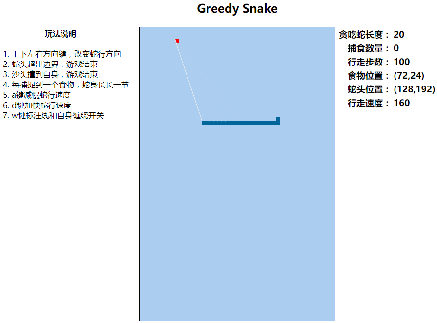

# 10. 贪吃蛇版本迭代（V10） 

- 张大为
- 辽宁师范大学计算机与信息技术学院@大连
- [https://daweizh.github.io/h5/](https://daweizh.github.io/h5/)  QQ:1243605845

## 10.1 需求说明

- 增加减速功能键a
- 增加加速功能键d
- 增加对准功能键w；放开蛇行缠绕的判断，使蛇头可以穿越自己
- 增加游戏说明布局

## 10.2 效果设计

## 10.3 编程过程

1. 增加游戏说明布局
    ~~~html
    <td valign="top" align="left" width="300px">
        <table>
            <tr><th>玩法说明</th></tr>
            <tr><td>
                <ol>
                    <li>上下左右方向键，改变蛇行方向</li>
                    <li>蛇头超出边界，游戏结束</li>
                    <li>沙头撞到自身，游戏结束</li>
                    <li>每捕捉到一个食物，蛇身长长一节</li>
                    <li>a键减慢蛇行速度</li>
                    <li>d键加快蛇行速度</li>
                    <li>w键标注线和自身缠绕开关</li>
                </ol>
            </td></tr>
        </table>
    </td>
    ~~~
2. 修改游戏状态信息栏宽度
    ~~~html
    <td valign="top" align="left" width="300px">
    ~~~
3. 设置游戏`power`变量
    ~~~js
    var oldX = oldY = snakeUnitSize;
    var power = 0;
    var heartbeat;
    var snakeSpeed;
    ~~~
4. 增加速度显示栏，在`window.onload`中增加
    ~~~js
    snakeSpeed = document.getElementById("snakeSpeed");
    ~~~
    修改
    ~~~js
    window.setInterval(snakeMove, speed);
    ~~~
    为
    ~~~js
    heartbeat = window.setInterval(snakeMove, speed);
    ~~~
    在`dispMessage`方法中增加
    ~~~js
    snakeSpeed.innerHTML = speed;
    ~~~
5. 在`document.onkeydown`事件中增加a键减速功能
    ~~~js
    case 28: //a
        speed = speed + 10;
        window.clearInterval(heartbeat);
        heartbeat=window.setInterval(snakeMove, speed);
        break;
    ~~~
6. 在`document.onkeydown`事件中增加d键加速功能
    ~~~js
    case 31: //d
        speed = speed - 10;
        if (speed<50) speed = 50;
        window.clearInterval(heartbeat);
        heartbeat=window.setInterval(snakeMove, speed);
        break;
    ~~~
7. 在`document.onkeydown`事件中增加w键校准开关
    ~~~js
    case 50: //w
        if(power==0)
            power = 1;
        else
            power = 0;
        break;
    ~~~
8. 在 `snakeMove`方法中记录蛇头刚刚走过的位置
    ~~~js
    oldX = x; //v10
    oldY = y; //v10
    ~~~
    增加蛇头穿越自身能力
    ~~~js
    if(power==0){
        for(var i=0; i<pathMap.length; i++){ //v7
            if( parseInt(pathMap[i].x)==x && parseInt(pathMap[i].y)==y){ //v7
                alert("你挂了，继续努力吧！失败原因：撞到自己了....."); //v7
                window.location.reload(); //v7
            } 
        } 
    }
    ~~~
    增加超级校准线能力
    ~~~js
    if(power==1)
        showPower();
    ~~~
9. 增加超级能力“校准线”功能
    ~~~js
    function showPower(){
        game.lineWidth = 2;
        game.strokeStyle = "#abcdef";

        game.beginPath();
        game.moveTo(oldX,oldY);
        game.lineTo(foodX * snakeUnitSize,foodY * snakeUnitSize);
        game.stroke();
        
        game.strokeStyle = "#f0f0f0";
        game.lineWidth = 1;
        game.beginPath();
        game.moveTo(x,y);
        game.lineTo(foodX * snakeUnitSize,foodY * snakeUnitSize);
        game.stroke();
    }
    ~~~        
    
## 10.4 代码注解

~~~html

... ...

    <h2>Greedy Snake</h2>
    <table>
        <tr>
            <!-- v10 增加游戏玩法说明栏 -->
            <td valign="top" align="left" width="300px">
                <table>
                    <tr><th>玩法说明</th></tr>
                    <tr><td>
                        <ol>
                            <li>上下左右方向键，改变蛇行方向</li>
                            <li>蛇头超出边界，游戏结束</li>
                            <li>沙头撞到自身，游戏结束</li>
                            <li>每捕捉到一个食物，蛇身长长一节</li>
                            <li>a键减慢蛇行速度</li>
                            <li>d键加快蛇行速度</li>
                            <li>w键标注线和自身缠绕开关</li>
                        </ol>
                    </td></tr>
                </table>
            </td>
            <td width="400px">
            ...
            </td>
            <td valign="top" align="left" width="300px">
            ... ...
            </td>
        </tr>
    </table>

~~~

## 10.5 核心代码

~~~
<!DOCTYPE html>
<html>
    <head>
        <meta charset="utf-8" />
        <title>Greedy Snake</title>
        
        
    </head>
    <body>
        

            <h2>Greedy Snake</h2>
            <table>
                <tr>
                    <td valign="top" align="left" width="300px">
                        <table>
                            <tr><th>玩法说明</th></tr>
                            <tr><td>
                                <ol>
                                    <li>上下左右方向键，改变蛇行方向</li>
                                    <li>蛇头超出边界，游戏结束</li>
                                    <li>沙头撞到自身，游戏结束</li>
                                    <li>每捕捉到一个食物，蛇身长长一节</li>
                                    <li>a键减慢蛇行速度</li>
                                    <li>d键加快蛇行速度</li>
                                    <li>w键标注线和自身缠绕开关</li>
                                </ol>
                            </td></tr>
                        </table>
                    </td>
                    <td width="400px">
                        <canvas id="field" width="400" height="600">
                            This is the field that snake snaking.
                        </canvas>
                    </td>
                    <td valign="top" align="left" width="300px">
                        <table class="show">
                            <tr>
                                <td align="right" nowrap="nowrap">贪吃蛇长度：</td>
                                <td align="left" id="snakes">35</td>
                            </tr>
                            <tr>
                                <td align="right">捕食数量：</td>
                                <td align="left" id="foods">14</td>
                            </tr>
                            <tr>
                                <td align="right">行走步数：</td>
                                <td align="left" id="steps">1000</td>
                            </tr>
                            <tr>
                                <td align="right">食物位置：</td>
                                <td align="left" id="foodPlace">14</td>
                            </tr>
                            <tr>
                                <td align="right">蛇头位置：</td>
                                <td align="left" id="snakePlace">1000</td>
                            </tr>
                            <tr>
                                <td align="right">行走速度：</td>
                                <td align="left" id="snakeSpeed">1000</td>
                            </tr>
                        </table>
                    </td>
                </tr>
            </table>
        

    </body>
</html>
~~~

## w.微信订阅号

1. 智数精英-关注中小学程序设计及相关讨论
2. 随话录-记录小朋友们的成长时光
2. 西山征途-关注大学生成长、学习和生活

----------

## b.[返回](../)

## h.[首页](../../)
